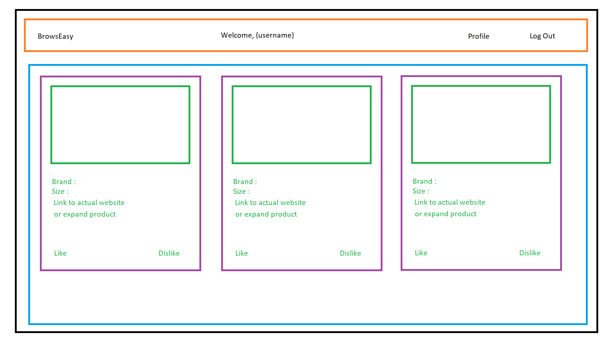

# BrowsEasy

#### By Meria Thomas

## Project Description
An app that provide a personalized feed of clothing  from fashion websites all around the web.

### Absolute minimum features the project requires to meet this purpose or goal:

- User's can create an account
-  User's can save fashion preferences  (gender, size to start with)
- User's see a feed of clothes that match their preferences
- Admin can add new clothes to the system

### Tools & Frameworks

- React
- Redux
- MySql or SQLite
- Node
- Bootstrap

### User-page Layout

#### Header Component (orange): contains the header
#### ProductList Component(blue): list of products available
#### Product Component(purple): consist of product structure

### Additional Features

- Add more preference options
- Add like/dislike for each piece of clothing

## Setup/Installation Requirements

- Clone this repository

- Navigate to the root directory in your terminal and run "npm install" to install necessary plugins.

## Development server

Run `npm run start` for a dev server. Navigate to `http://localhost:8080/`. The app will automatically reload if you change any of the source files.

## In progress
- Reduce pint button by 1 when clicked
- Let the employee edit a beer

## Technologies Used

- jsx
- HTML & CSS
- Bootstrap
- React